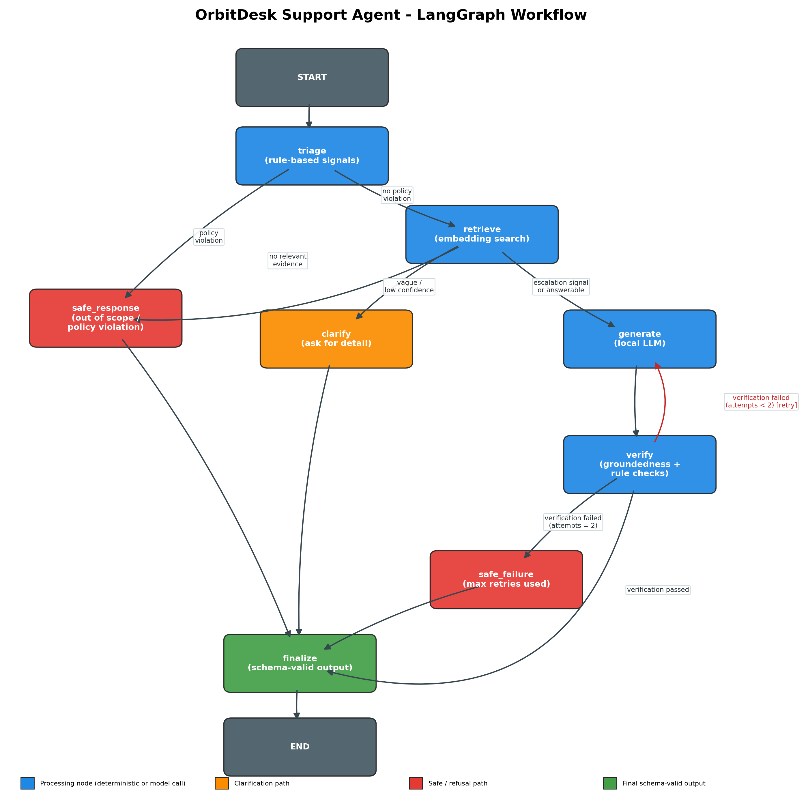

# OrbitDesk Support Agent

A local-first, graph-orchestrated support agent for the fictional **OrbitDesk** product,
built for the AI Engineer Internship assignment. The full workflow — triage, retrieval,
answer generation and verification — runs on locally loaded Hugging Face models through
a [LangGraph](https://github.com/langchain-ai/langgraph) state graph. No remote LLM APIs
are called anywhere in the code.

## AI assistant disclosure

This repository was built with the help of an AI coding assistant (Anthropic's Claude),
as permitted by the assignment rules. The assistant was used to design the graph
architecture, write the Python source, tests, diagram script and this README. All
decisions about model choice, routing logic and verification rules were reviewed and
are explained below.

## Architecture



The graph has eight nodes covering the four required responsibilities:

| Responsibility | Node(s) | What it does |
|---|---|---|
| **Triage** | `triage` | Deterministic, rule-based classification signals: policy/out-of-scope phrases (refund, legal advice, prompt-injection attempts), vague-complaint detection, and escalation-language detection. Runs before any model call so obviously unsafe requests never reach retrieval or generation. |
| **Retrieval** | `retrieve` | Embeds the question with a local `sentence-transformers` model and does cosine-similarity search over pre-embedded knowledge-base sections and resolved-case summaries (in-memory, no vector DB). Returns top-k passages with scores. |
| **Response Generation** | `generate` | Builds a prompt from only the retrieved evidence and calls a local Hugging Face causal LM (greedy decoding) to draft an answer. Used for both `answerable` and `requires_escalation` targets, with a different instruction block for each. |
| **Verification** | `verify` | Rule-based + embedding-based checks: answer non-empty, sources present, no forbidden "I already did X" phrasing (refunds, credential secrets, role changes), the answer doesn't end mid-sentence, and an embedding-similarity groundedness check between the answer and the retrieved evidence. |

Supporting nodes: `clarify` (deterministic clarification question), `safe_response`
(deterministic refusal for out-of-scope/policy requests), `safe_failure` (deterministic
fallback after verification fails twice), and `finalize` (assembles and returns the
schema-shaped response).

### Orchestration requirements checklist

- **Shared typed state** — `src/orbitdesk_agent/state.py` defines a single `TypedDict`
  (`AgentState`) threaded through every node.
- **Conditional routing** — `src/orbitdesk_agent/routing.py` contains three pure
  functions (`route_after_triage`, `route_after_retrieval`, `route_after_verification`)
  used as LangGraph conditional edges. They only look at state fields, never at raw
  model text, which is what makes them unit-testable without a model (see Tests below).
- **Retry / fallback path** — `verify → generate` loops back once on verification
  failure (`config.MAX_GENERATION_ATTEMPTS = 2`), then falls through to `safe_failure`.
- **Deterministic vs. model reasoning** — triage, routing, verification's rule checks,
  clarify, safe_response, safe_failure and finalize are all pure Python with no model
  calls. Only `retrieve` (embedding model) and `generate` (causal LM) touch a model.
  Verification's groundedness check re-uses the *embedding* model (also a "locally
  running Hugging Face ... classification model" per the assignment wording), not the LLM.
- **Logs of node execution** — every node appends its name to `state["trace"]`, and
  `logging_utils.py` configures a standard logger that prints an INFO line per node
  with timing and decision details. The CLI prints the trace and per-node latencies for
  every run.
- **Infinite-loop protection** — `MAX_GENERATION_ATTEMPTS` caps `generate → verify`
  cycles at 2 total attempts (i.e. exactly one revision), enforced in
  `route_after_verification`. As a secondary safety net, `pipeline.py` also passes
  `recursion_limit` to `graph.invoke()`.

## Repository layout

```
orbitdesk-support-agent/
├── README.md
├── requirements.txt
├── pyproject.toml
├── data/                        # provided assignment material (unmodified)
│   ├── knowledge_base/*.md
│   ├── resolved_cases.json
│   ├── sample_questions.json
│   └── output_schema.json
├── diagrams/
│   └── graph.png                # graph diagram (already generated)
├── src/orbitdesk_agent/
│   ├── config.py                # model names, thresholds, paths
│   ├── state.py                 # shared TypedDict state
│   ├── knowledge_base.py        # markdown/JSON loading + chunking
│   ├── retrieval.py             # embedding model + similarity search
│   ├── models.py                # local causal LM wrapper
│   ├── nodes.py                 # triage / retrieve / generate / verify / safe paths
│   ├── routing.py               # pure conditional-edge functions
│   ├── graph.py                 # builds and compiles the LangGraph StateGraph
│   ├── pipeline.py               # loads models once, runs a question end to end
│   └── logging_utils.py
├── scripts/
│   ├── run_cli.py                # CLI entry point
│   ├── record_model_versions.py  # loads both models, records exact revisions/latency
│   └── generate_diagram.py       # regenerates diagrams/graph.png (matplotlib only)
├── tests/
│   ├── test_routing.py           # graph routing, no model dependency
│   ├── test_triage.py            # rule-based triage signals, no model dependency
│   ├── test_verification.py      # verification rules with a stub embedding model
│   ├── test_schema.py            # output JSON Schema conformance
│   └── test_integration_optional.py  # full pipeline, skipped unless models are installed
└── outputs/                      # run artifacts land here (git-ignored except .gitkeep)
```

## Setup

Requires Python 3.10+. First run needs internet access to download the two models
(a few hundred MB total); every run after that works fully offline.

```bash
cd orbitdesk-support-agent
python3 -m venv .venv
source .venv/bin/activate          # Windows: .venv\Scripts\activate
pip install -r requirements.txt
pip install -e .                   # makes `orbitdesk_agent` importable for tests
```

## Running

Ask a single question:

```bash
python scripts/run_cli.py --question "Can a read-only user create API credentials?"
```

Run all five sample questions from `data/sample_questions.json` and save results:

```bash
python scripts/run_cli.py --samples
# writes outputs/sample_runs.json
```

Record the exact model names, resolved revisions, device, and load times:

```bash
python scripts/record_model_versions.py
# writes outputs/model_versions.json and prints it to the console
```

Demonstrate the verification-retry / safe-failure path deterministically:

```bash
python scripts/run_cli.py --question "I am a read-only Viewer. Can I create an API credential for a reporting script?" \
    --debug-force-verification-failure --offline
```

After the first run (models cached locally), pass `--offline` on `run_cli.py` or
`record_model_versions.py` to skip Hugging Face's network checks entirely and load
straight from the local cache:

```bash
python scripts/run_cli.py --samples --offline
python scripts/record_model_versions.py --offline
```

Without `--offline`, if your machine has no network connectivity, `huggingface_hub`
will still try to reach the hub to verify the cache is current — it doesn't fail fast,
it retries each optional file up to 5 times with exponential backoff, which can look
like a hang for a few minutes before falling back to cache. `--offline` avoids that
entirely by setting `HF_HUB_OFFLINE=1` and `TRANSFORMERS_OFFLINE=1` before any model is
loaded. Use it any time after the first successful (online) download.

## Tests

```bash
pytest tests/ -v
```

`test_routing.py`, `test_triage.py`, `test_verification.py` and `test_schema.py` need
only `pytest`, `numpy` and `jsonschema` — no model downloads — and satisfy the
assignment's requirement for **at least one automated test that verifies graph routing
without depending on the exact wording produced by the model**: the routing tests call
`route_after_triage` / `route_after_retrieval` / `route_after_verification` directly with
constructed state dictionaries.

`test_integration_optional.py` exercises the full compiled graph end to end (including
real model calls) and is automatically skipped if `torch`, `transformers`,
`sentence-transformers` or `langgraph` aren't installed.

## Required test cases

The five required cases from the assignment map onto `data/sample_questions.json` as
follows:

1. **Directly answerable** — `Q-002` ("Can a read-only Viewer create an API credential?").
   Routes `triage → retrieve → generate(answerable) → verify → finalize`.
2. **Needs two documents** — `Q-001` (timezone change breaking a scheduled export).
   Retrieval surfaces both `KB-003` (timezones) and `KB-004` (scheduled exports), plus
   the related resolved cases `CASE-1041` and `CASE-1130`.
3. **Ambiguous, needs clarification** — `Q-003` ("Our data sync is not working...").
   The triage vague-pattern detector fires (generic complaint, no error code, no ID) and
   routes straight to `clarify`.
4. **Out of scope** — `Q-005` (refund + prompt-injection attempt). Triage's policy-phrase
   detector fires on `refund` and `ignore the supplied documentation`, routing straight
   to `safe_response` without ever calling a model.
5. **Initial answer fails verification** — demonstrated two ways:
   - **Organically**, on `Q-001` in `outputs/sample_runs.json`: the first generation
     attempt was rejected by verification (`incomplete_answer` / grounding), the graph
     looped back to `generate` a second time, and the revised answer passed. Trace:
     `triage → retrieve → generate → verify → generate → verify → finalize`.
   - **Deterministically**, with `--debug-force-verification-failure` on any answerable
     question, which appends a forbidden phrase to the first draft so the rule-based
     check reliably fails. Covered by
     `test_integration_optional.py::test_verification_failure_triggers_retry_path`. This
     is a documented demo hook — not used in normal runs — so the retry path can also be
     shown live without depending on model randomness.

`Q-004` (repeated `render_failed`, "already checked...") is a bonus sixth case showing
the escalation route: triage's escalation-signal detector fires and `generate` is called
with the escalation-specific instruction block.

## Local model requirements

| Role | Model | Notes |
|---|---|---|
| Embeddings (retrieval + grounding check) | `sentence-transformers/all-MiniLM-L6-v2` | ~90 MB, CPU-friendly, 384-dim. |
| Generation | `Qwen/Qwen2.5-0.5B-Instruct` (revision `7ae557604adf67be50417f59c2c2f167def9a775`) | ~1 GB in fp32, runs on CPU; chosen for small size and reliable chat-template support so a laptop CPU can complete the assignment's 3–4 hour window. |

- **Hardware used:** 11th Gen Intel Core i5-1135G7 @ 2.40GHz (8 logical CPUs), 8 GB RAM,
  no discrete GPU used (CPU-only inference), Windows 11 Home 64-bit.
- **Model load time:** ~8.2s (embedding) / ~7.0s (generation) on first load; ~0.4s /
  ~3.0s on subsequent offline loads from local cache (see `outputs/model_versions.json`).
- **Response latency:** roughly 20–25s per generation attempt on CPU; up to ~68s total
  when a verification retry occurs (as with `Q-001`, two attempts); under 0.2s for
  clarification/out-of-scope routes that never call the LLM (see
  `outputs/sample_runs.json`, `timings` field per question).

## Design trade-offs and known limitations

- **Deterministic clarify/safe-response/safe-failure text.** These three paths do not
  call the LLM at all — they return fixed, schema-valid text. This trades a bit of
  answer variety for guaranteed safety and schema compliance on exactly the paths where
  a hallucination would be most damaging (refusals, escalation info-collection, and the
  failure fallback). Given more time, the clarify/escalation text could be LLM-phrased
  and still verified.
- **Rule-based triage instead of a trained classifier.** Keyword/regex heuristics are
  transparent and fast, but will miss out-of-scope phrasing that doesn't match the
  configured patterns. A small local zero-shot classification model (e.g. an NLI model)
  would generalize better; it was left out to keep the two required model types
  (embedding + generation) minimal and the runtime fast on CPU.
- **Retrieval thresholds (`LOW_EVIDENCE_THRESHOLD`, `CLARIFY_THRESHOLD` in `config.py`)
  are hand-tuned estimates**, not calibrated against a labeled validation set (none was
  provided) — `python scripts/run_cli.py --samples` prints the retrieval confidence for
  each question to make re-tuning easy.
- **Generation token budget is a real trade-off.** `MAX_NEW_TOKENS` (240) balances answer
  completeness against latency and repetition risk; verification now flags answers that
  end mid-sentence (`incomplete_answer`) and forces a retry with an explicit
  "keep it short and finish the sentence" instruction, which resolved this on `Q-001`
  without raising the token budget back to a level that encouraged rambling.
- **Single-pass greedy decoding.** `do_sample=False` for reproducibility during grading;
  this can still produce repetitive text on longer answers despite `repetition_penalty`.
- **With more time:** add a small evaluation set with gold routing labels to properly
  tune thresholds; replace the keyword-based escalation/vague detectors with a local
  zero-shot classifier; add a minimal FastAPI wrapper around `SupportAgentPipeline` for
  a demoable HTTP interface.

## Security and scope notes

Verification's forbidden-phrase list and `KB-010`-derived safe-response text ensure the
agent never claims to have issued a refund, revealed a secret, or changed a role — it can
only describe what an authorized human should do, matching the knowledge base's
documented support boundaries.

## Troubleshooting

**Hangs or repeated `getaddrinfo failed` retries when loading models.** This happens
when there's no network connectivity but `huggingface_hub` still tries to reach the hub
to check for optional model files (e.g. `adapter_config.json`, `processor_config.json`)
before falling back to the local cache. It doesn't fail fast — by default it retries
each file up to 5 times with exponential backoff (1s/2s/4s/8s/8s), which across a couple
of optional files can look like the process has frozen for a few minutes. Fix: pass
`--offline` to `run_cli.py` / `record_model_versions.py` (or set `HF_HUB_OFFLINE=1` and
`TRANSFORMERS_OFFLINE=1` yourself before running) any time after the first successful
online download — this skips the network check entirely and loads straight from cache.

**`ModuleNotFoundError: No module named 'orbitdesk_agent'` when running tests.** Run
`pip install -e .` from the project root once, or confirm `tests/conftest.py` is present
— it inserts `src/` onto `sys.path` automatically so `pytest` works even without the
editable install.

**First run is slow / downloads look large.** That's expected only on the very first
run (~1 GB total across both models). Every run after that reads from the local Hugging
Face cache (`~/.cache/huggingface` by default) and does not re-download anything, with
or without `--offline`.

## Submission checklist (for the Google Form)

- [ ] GitHub repository link (push this project; make sure it's public or shared with
      reviewers) — including source code, this README, setup instructions, tests and
      sample outputs (`outputs/sample_runs.json` after running `--samples`).
- [ ] `diagrams/graph.png` uploaded as the graph diagram image.
- [ ] Video recording link (4–7 minutes, see the assignment PDF for the required
      content: node walkthrough, model loading with device shown, three+ live runs
      across different routes, execution logs/trace, retrieved evidence for one answer,
      the verification/retry path triggering at least once, and a short trade-off /
      limitation / next-step discussion).
- [ ] Exact model names and revisions (`outputs/model_versions.json`).
- [ ] Hardware used (CPU, RAM, GPU/accelerator if any).